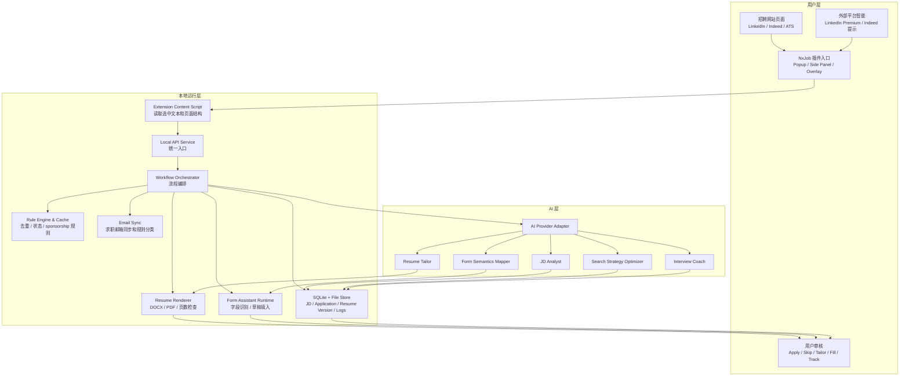
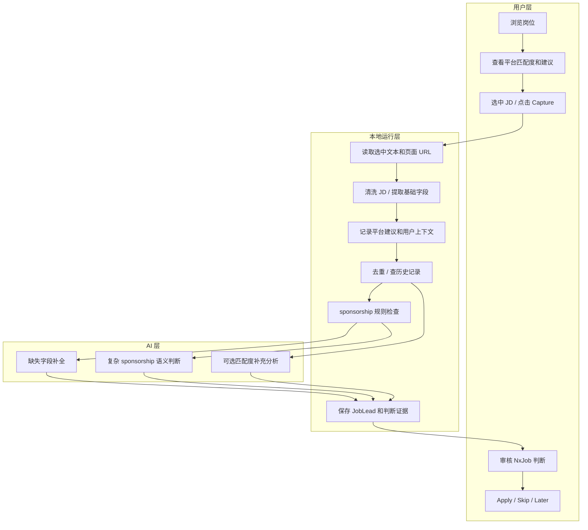
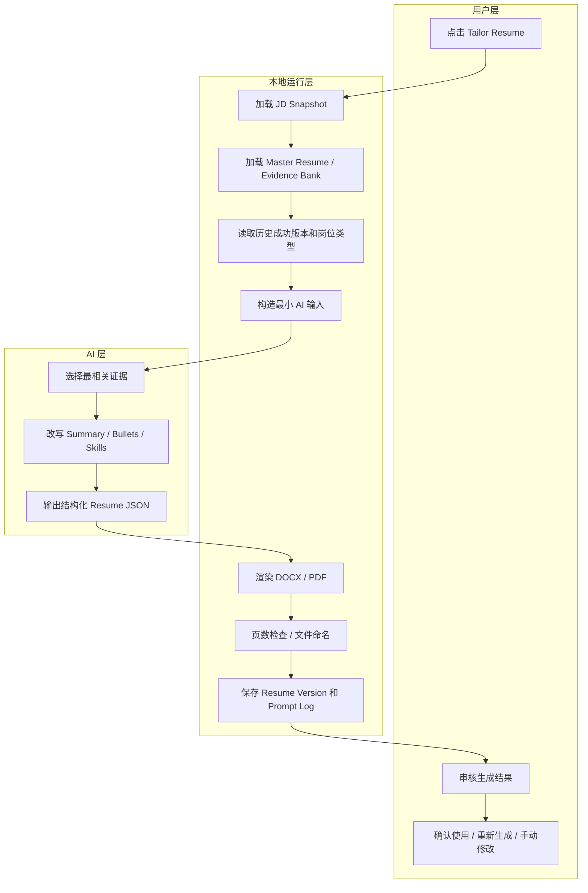
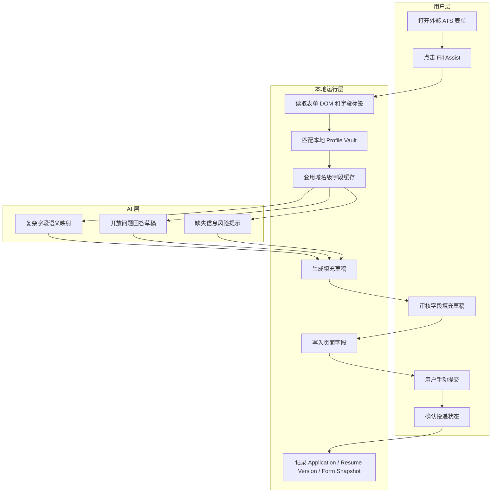
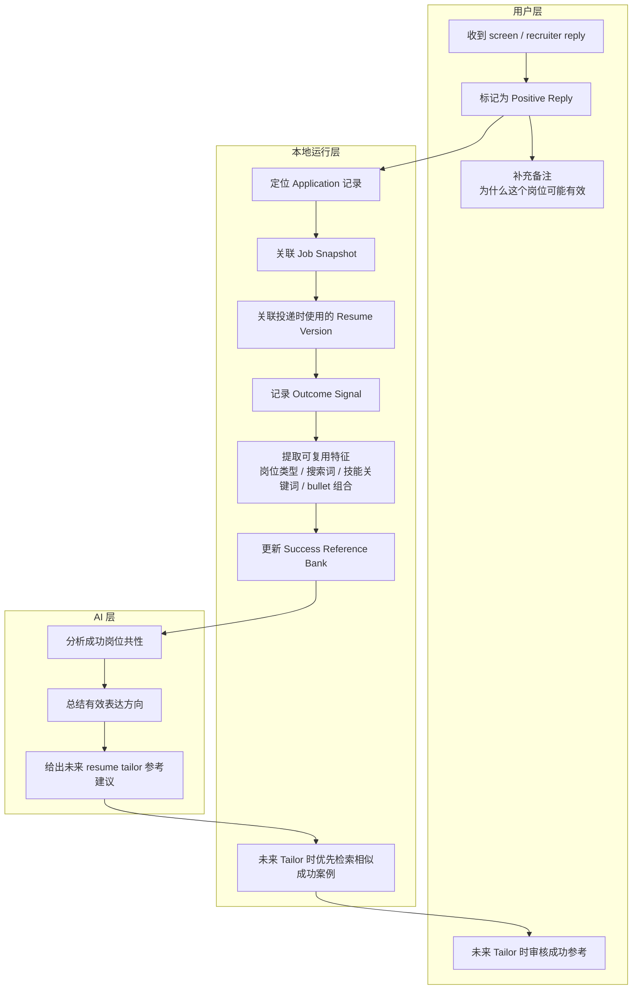
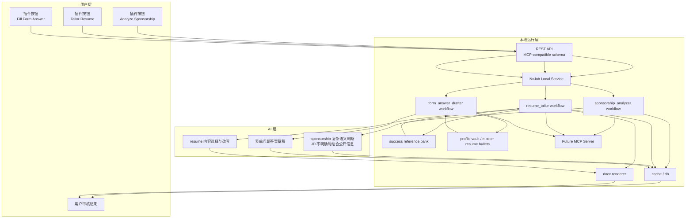
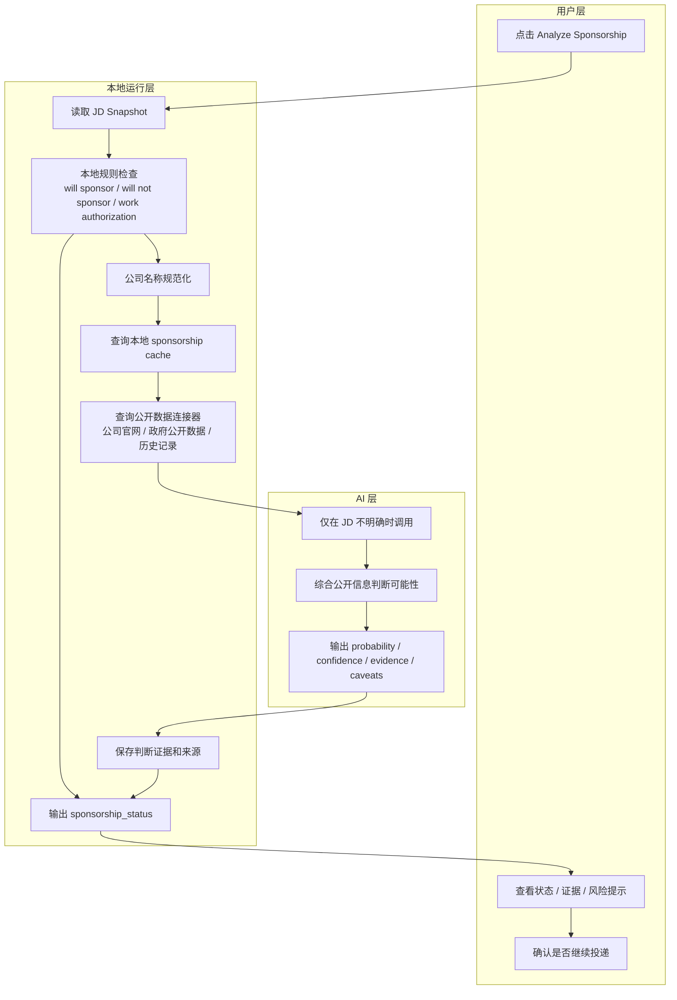
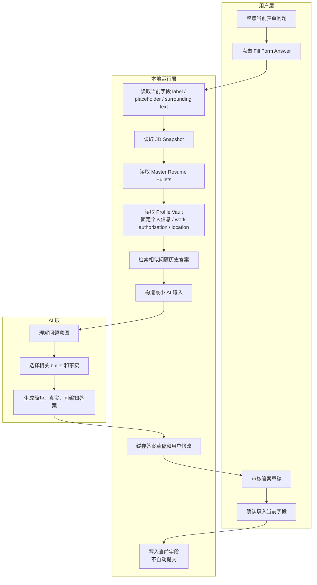

# NxJob Product Blueprint

## Product Principle

NxJob 的目标不是替用户自动求职，而是把求职中高频、低价值、重复性的操作下沉到本地运行层；把语义复杂、需要判断和表达质量的任务交给 AI；把用户动作压缩到浏览、点击、审核、确认。

早期 NxJob 不重复建设招聘网站和 LinkedIn Premium 已经做好的判断能力。平台已有的匹配度、简历建议、面试建议可以先作为外部智能来源使用。NxJob 负责记录这些判断、用户决策和最终结果，并在数据积累后，把稳定逻辑逐步固化到本地运行层或 AI 层。

NxJob 要具备自学习、自迭代属性。它不应只记录“投了什么岗位”，还要持续记录“为什么投、参考了什么判断、使用了哪个 resume 版本、后续是否收到回复、哪些搜索词和岗位类型更有效”。这些反馈会逐步反哺搜索策略、匹配判断、resume tailor、表单填写和面试准备，让系统从用户的真实求职结果中变得更贴合个人。

核心设计原则：

- 用户层优先减少动作：默认只要求用户浏览、点击、审核、确认。
- 本地运行层优先固化流程：能用规则、缓存、模板、数据库解决的问题，不优先消耗 AI token。
- AI 层优先处理复杂语义：岗位理解、表达改写、策略复盘、面试演练等不稳定问题交给 AI。
- 外部智能优先复用：早期充分利用 LinkedIn Premium、Indeed 和 ATS 页面已有信息，不重复造轮子。
- 反馈数据优先沉淀：每次捕获、判断、tailor、投递、回复和面试都应成为后续优化依据。
- 用户确认不可跳过：NxJob 可以辅助填写和建议操作，但不自动提交、不绕过验证、不进行无确认群投。

## Diagram Rule

NxJob 后续所有流程图默认分层绘制，必须明显区分用户层、本地运行层、AI 层。

- 用户层：用户可见、需要用户判断或确认的动作，例如浏览、点击、审核、提交。
- 本地运行层：可固化、可缓存、可测试、可复用的流程，例如页面读取、清洗、去重、模板渲染、数据库记录、文件生成、状态流转。
- AI 层：处理不确定语义和表达质量的问题，例如 JD 解析、匹配判断、resume tailor、复杂表单语义映射、搜索策略复盘、面试预演。

流程图规则：

- 每张流程图都用 `subgraph` 或等价结构拆出三层。
- 用户确认动作必须留在用户层。
- 本地可规则化的动作不得默认画进 AI 层。
- AI 输出必须回到本地运行层记录，再交给用户层审核。
- 外部平台智能，例如 LinkedIn Premium 建议，作为用户层可见输入或本地层记录来源，不视为 NxJob 内部 AI 能力。

## Architecture

NxJob 采用浏览器插件加本地服务的轻量架构。浏览器插件贴近网页，负责用户入口和页面交互；本地服务负责稳定流程、文件生成、数据库、AI 编排和可迭代记录。

## Workflow

### Workflow 1: Capture JD and Decide

目标：用户在招聘网站正常浏览，NxJob 只在用户主动点击后捕获 JD、记录平台判断，并补充 sponsorship 检查。

### Workflow 2: Tailor Resume

目标：让 resume tailor 在一到两分钟内完成。AI 负责内容选择和表达，本地层负责证据准备、模板渲染、页数检查和版本记录。

### Workflow 3: Apply Assistant and Tracking

目标：降低非 Easy Apply 表单填写成本，但保留用户最终确认，不自动提交。

### Workflow 4: Success Feedback Loop

目标：把已经获得 screen / recruiter reply / interview 的岗位和对应 resume 版本沉淀为未来 tailor 的高价值参考，而不是只把它们当作普通投递记录。

成功反馈应至少记录：

- 原始 JD snapshot。
- 投递时使用的 resume version。
- 使用的搜索词或来源路径。
- 平台匹配度、LinkedIn Premium 建议或用户当时的判断。
- 是否支持 sponsorship，以及当时的判断依据。
- 投递日期、回复日期、回复类型。
- 哪些 bullet、技能关键词、项目经历可能促成回复。
- 用户复盘备注。

这些记录会进入 `Success Reference Bank`。未来 resume tailor 时，本地运行层先检索相似成功案例，再把最相关的成功参考压缩后交给 AI 层使用，避免每次都从零判断，也避免无节制增加 token。

## MCP / Skill Strategy

NxJob 会把 `Analyze Sponsorship`、`Tailor Resume`、`Fill Form Answer from Master Resume Bullets` 设计成插件里的一键能力，但首版不要求浏览器插件直接成为 MCP client。插件负责触发和展示，本地服务负责稳定执行和记录，AI 层只处理复杂语义和表达改写。

分阶段策略：

- Phase 1：插件做三个一键按钮；本地服务实现三个稳定 workflow；接口先用 REST；schema 按 MCP tool 的输入输出标准设计。
- Phase 2：同一套 workflow 暴露为 MCP tools：`analyze_sponsorship`、`tailor_resume`、`draft_form_answer_from_resume_bullets`。
- Phase 3：插件可以选择继续走 REST，或者变成 MCP client；外部 AI 客户端也可以调用 NxJob MCP server。

首版固定能力：

- `Analyze Sponsorship`：判断岗位是否支持 sponsorship，输出状态、证据、置信度、风险提示、需要确认的问题。
- `Tailor Resume`：基于 JD、master resume、success reference bank 生成定制 resume，并记录 resume version、选用证据、变更摘要和文件路径。
- `Fill Form Answer from Master Resume Bullets`：根据当前表单问题、JD、master resume bullets 和 profile vault 生成答案草稿，用户审核后填入当前字段。

设计约束：

- 插件按钮属于用户层，只负责触发、展示和确认。
- 本地服务属于本地运行层，负责 workflow、缓存、数据库、文件生成、日志和后续 MCP 暴露。
- AI 层只负责 sponsorship 复杂语义判断、resume 内容选择与改写，以及复杂表单问题答案草稿。
- REST 接口的输入输出 schema 要尽量接近未来 MCP tool schema，避免 Phase 2 重写业务逻辑。
- MCP 化不能改变安全边界：仍然不自动提交、不绕过验证、不无确认群投。

## Sponsorship Evidence Strategy

Sponsorship 判断分两阶段处理：JD 明确时优先用本地规则；JD 不明确时，才由 AI 结合公开信息做概率判断。

Sponsorship 状态只能表达求职决策风险，不表达法律结论：

- `supports`：JD 或可信来源明确支持。
- `does_not_support`：JD 或可信来源明确不支持。
- `likely_supports`：公开信息显示该公司有较强 sponsorship 历史，但当前岗位未明确。
- `likely_not_supports`：公开信息或岗位条件显示支持概率较低，但当前岗位未明确拒绝。
- `needs_confirmation`：需要向 recruiter 或申请表继续确认。
- `unknown`：证据不足。

MVP 判断优先级：

1. 当前 JD 或申请表中的 role-specific 明确政策，例如 `not eligible for visa sponsorship` 或 `sponsorship is available for this role`。
2. 申请表筛选语句，例如 `authorized to work without sponsorship now or in the future`。
3. 泛化 work authorization 语句，例如 `authorized to work in the United States`。这类语句只能触发确认，不能直接等同于不支持 sponsorship。
4. 公司政策、历史投递、政府公开数据或第三方聚合数据。这些信息只能作为概率证据，不能覆盖当前岗位的明确拒绝。

公开信息优先级：

- 当前 JD 和申请表原文。
- 公司官网、career page、FAQ。
- 政府公开数据，例如 USCIS H-1B Employer Data Hub、DOL OFLC LCA disclosure data。
- 用户历史投递和 recruiter 回复。
- 第三方聚合数据只能作为辅助线索，不作为确定结论。

后续阶段，当 sponsorship 流程跑成熟后，可以把稳定规则和公开数据查询流程固化为 `analyze_sponsorship` skill / MCP tool。

## Form Answer Drafting Strategy

`Fill Form Answer from Master Resume Bullets` 解决的是非 Easy Apply 表单里的开放问题或半结构化问题，例如 why this company、relevant experience、work authorization explanation、project description、additional information。

实现原则：

- 优先复用 master resume bullets，不临场编造新事实。
- 常见固定字段走本地 Profile Vault，不消耗 AI token。
- 相同公司或相似问题优先复用历史答案。
- AI 只生成草稿，用户确认后才填入。
- 永远不自动点击 submit。
